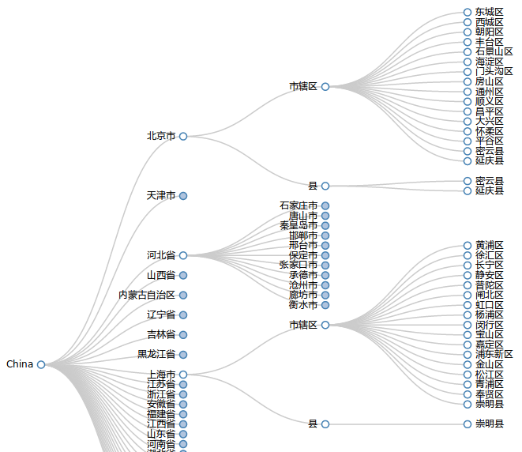

scrapy-stats
============

Scrapy项目，抓取国家统计局区划代码，并用D3.js可视化

## 组成
抓取[国家统计局统计用区划代码](http://www.stats.gov.cn/tjsj/tjbz/tjyqhdmhcxhfdm/)，得到2009-2013五年的统计用区划代码，以2013年为例：

layer |count(code)| name     
------|-----------|------------
1     | 31        | 省/市/自治区
2     | 345       | 市
3     | 2856      | 县/区
4     | 43854     | 乡/镇/街道
5     | 694688    | 村/居委会

## 可视化
Demo：[http://phyng.com/scrapy-stats/](http://phyng.com/scrapy-stats/)

